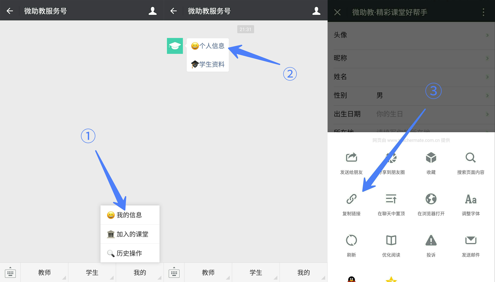
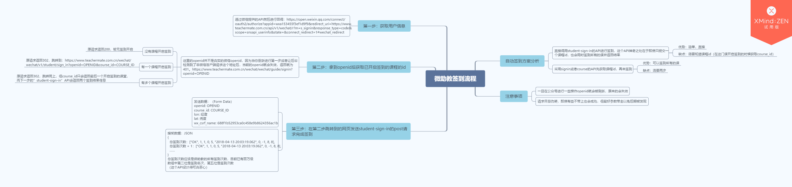

# 微助教自动签到

受[这篇文章](https://morrieati.github.io/hacking-teachermate-v1/)启发而写的一个功能更加完备的微助教自动签到脚本。

## 功能

- 自动签到同一个用户（openid）所有开启签到的课
- 支持自定义签到延迟时间以及签到位置
- 签到成功日志记录以及openid过期提示和日志记录
- 签到成功后可自动继续签到下一门课

## 快速开始

**1. 获取账户的openid**



提取所复制链接中的openid即可。

请注意如果再次点击公众号内的链接，会重新生成新的openid，旧的openid会失效。

**2. 运行程序**

请首先安装[nodejs](https://nodejs.org)并确保版本 >= 7.6.0。

```bash
git clone https://github.com/taoweicn/teachermate-auto-check-in.git  # or download zip
cd teachermate-auto-check-in  # or open the directory manually
npm start  # or use yarn
```
注：

- Windows用户开启终端方法：按住shift同时单击鼠标右键选择打开powershell。
- 第一次运行程序时请注意输入openid，签到时延（每次尝试签到的间隔时间）和位置（经度和纬度，空格分隔）。
- 程序开启后请不要在微助教公众号里点击任何链接，否则会刷新openid导致原openid失效，这时需要重新输入openid。
- 如果课堂开启了GPS位置签到而又没输入位置，后台只会在签到开启时显示定位失败，签到关闭后并没有显示相关信息。
- 签到一门课成功后会在5分钟后自动开启下一轮尝试。
- 日志文件在log文件夹下。

## 原理

微助教签到流程



本质上是不断向服务器发起签到请求，一旦有课程开启了签到就会自动完成签到。

程序运行流程如下：

1. 每隔一定时延（可手动设置时延长短）向服务器发送signin的请求，如果有课程开启签到，会返回302，通过读取headers里的location来获取课程id。
2. 再次向服务器发送student-sign-in的请求来完成签到。
3. 若返回的响应中出现401则会提示重新获取openid。

## API参考

[微助教API参考](docs/teachermate_API_reference.md)

## 注意事项

- 第一次运行程序会设置openid，签到时延和签到位置，如果openid过期会自动提示更改，但如果需要改动签到时延和签到位置需要去目录data下打开data.json手动更改。
- 建议合理设置签到时延（默认2秒），以免频繁发送签到请求而被发现。
- 如果微助教api发生变动则本程序可能会失效，请不要过分依赖。

## 问题反馈

在[这里](https://github.com/taoweicn/teachermate-auto-check-in/issues)提问或者在[这里](https://github.com/taoweicn/teachermate-auto-check-in/pulls)帮助我完善这个程序。

## TODO

- [ ] 多账户签到
- [ ] 日志记录签到成功的课程名
- [ ] 使用electron构建桌面端程序